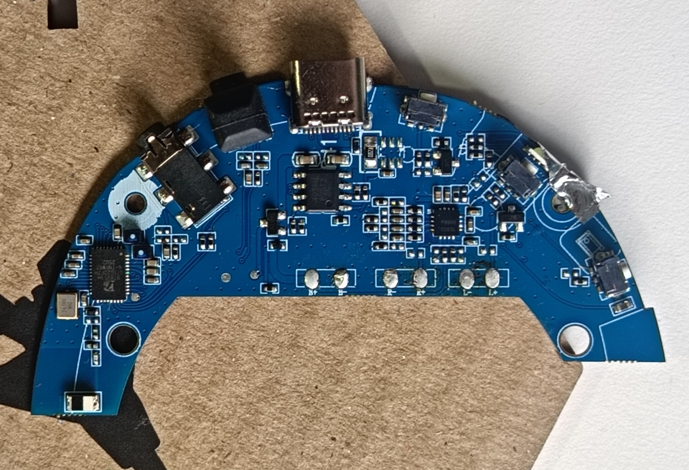
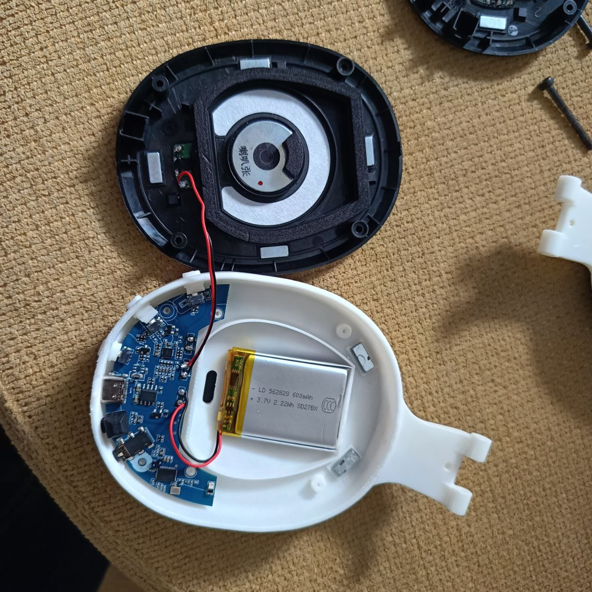
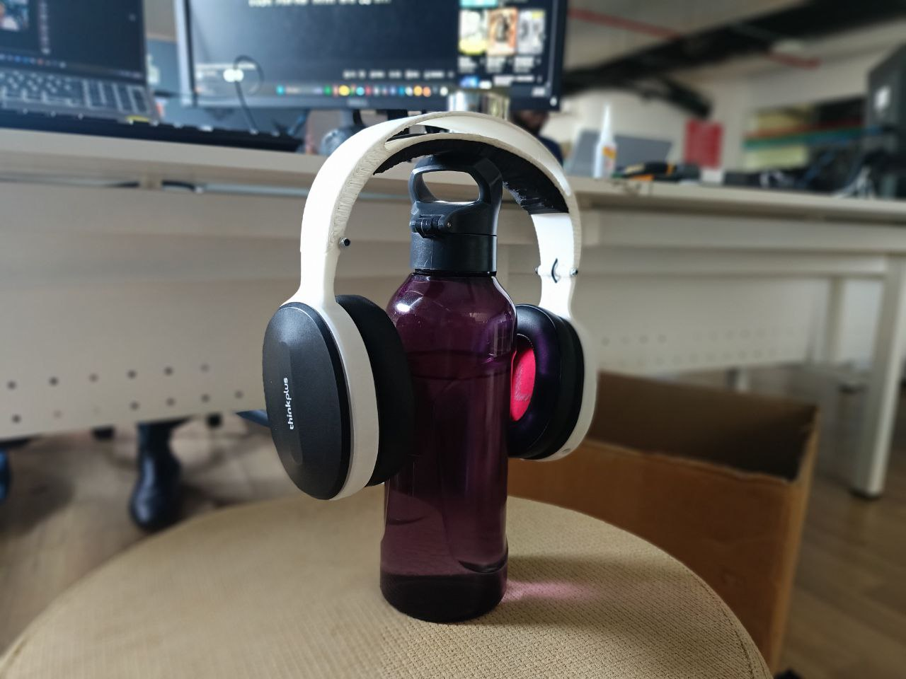
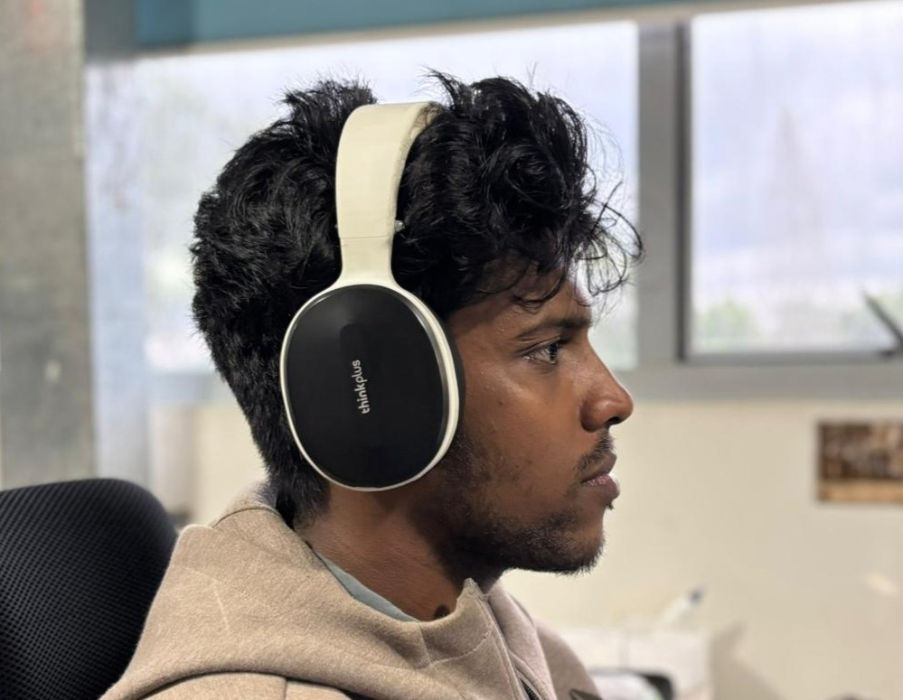

# Headphone Reverse Engineering Project

This project documents the redesign and rebuild of a Lenovo-branded headphone clone purchased at Maker Faire Shenzhen. After the headband broke on day two, I reverse-engineered the design using Rhino and Fusion 360, 3D printed replacement parts in PLA, and reassembled it using the original electronics, magnets, and fasteners — keeping it out of landfill and adding a new folding hinge mechanism in the process.

---

## Background

This project started from a frustrating situation. I travelled to Shenzhen to attend Maker Faire and visited HuaQiangBei (HJ), where I came across a pair of headphones branded as Lenovo. What caught my attention was the design — removable ear cups attached magnetically, and interchangeable back panels. I didn't know at the time that they were a copy, but I purchased them anyway.

On the way home, at the airport, I accidentally broke them. It was only the second day after purchase. I had spent money on them and felt genuinely bad about it — but instead of throwing them away, I took it as a challenge to reverse engineer the design entirely, reuse the working components, and avoid creating e-waste.

*The headphone with its original box — the packaging looked convincing and the build quality was impressive*

---

## Problem Analysis

The part that broke was the headband/headrest. I placed it on a cutting mat, took measurements, and studied its features carefully before starting any redesign work.

*The headrest broken at the center — the curved geometry concentrated stress at this point*

Through this analysis, I identified the root cause: the curved headrest geometry placed excessive stress at the center section during flexing. The material used in the original (injection-molded plastic) was not flexible enough to handle this, making it a design flaw as much as a material one.

---

## Design Process

### Attempt 1 — Direct Replica

My first approach was to recreate the original headrest as closely as possible so the original foam padding would fit. I designed it in Rhino, going through multiple iterations to capture the curves accurately. The challenge was that measuring a curved, foam-padded component precisely is inherently difficult.

*Rhino design iterations of the headrest — getting the curves right required multiple rounds of measurement and reprinting*

After several prints, this approach didn't work well. The foam padding from the original wouldn't fit properly, and other mating parts (which were injection-molded) had tolerances that 3D printing couldn't reliably replicate.

### Attempt 2 — Full Redesign from Scratch

With the direct replica approach ruled out, I shifted to designing the entire headphone from scratch while reusing as many original components as possible — specifically the PCB, speakers, ear cups, back panels, magnets, and fasteners.

The first step was disassembly. I took apart the entire unit and started from the PCB and its mounting geometry.

*The original PCB — this was reused entirely in the new design*

The side housings (where the speakers sit) were designed in Rhino since the magnetic attachment system for the ear cups and back panels required precise curve replication. I took detailed measurements and matched the geometry as closely as possible so the original magnetic components would function correctly.

*Side housing designed in Rhino to match the original magnetic attachment geometry*

Once the side housings were finalized, I imported them into Fusion 360 and designed the rest of the headphone around them. One addition I made at this stage was a **folding hinge mechanism** — something the original didn't have — so the headphones could be folded flat for easier storage and transport.

<video width="640" height="360" controls>
  <source src="./Media/Fusion Designe.mp4" type="video/mp4">
  Your browser does not support the video tag.
</video>

*Fusion 360 model showing the complete headphone design with the folding hinge mechanism*

---

## Manufacturing & Assembly

All parts were printed in **PLA**. Most fasteners were salvaged from the original headphone. Two additional M__ nuts and bolts were sourced separately to support the new hinge mechanism (the original had no hinge, so no mounting points existed for it).

*All printed parts before assembly*

The internal layout kept the PCB, battery, and magnets in their original positions. Magnets were transplanted from the original unit so the ear cups and back panels retained their snap-on magnetic attachment. Buttons were also redesigned and printed to work with the existing board.

One compromise was necessary: a single LED on the main PCB had to be removed because it interfered with the 3D printed button mechanism.

*Internal layout — PCB, battery, and magnets in position before final assembly*

---

## Result

*The finished headphone — fully functional, foldable, and built almost entirely from the original components*

The final assembly works correctly. Audio quality, button controls, and magnetic attachment all function as expected. The folding mechanism adds genuine utility over the original design. The headphones have been in daily use since assembly with no issues.

*Daily driving the rebuild*

---

## Lessons Learned

- Curved, foam-padded components are difficult to reverse engineer precisely with a tape measure — a 3D scanner would have saved several iterations.
- Injection-molded tolerances are hard to match with FDM printing. Designing around the original parts (rather than copying them exactly) was the right call.
- The original headband failure was a design flaw, not just a material one — the geometry concentrated stress at the weakest point.
- Reusing electronics, magnets, and fasteners from a broken product is practical and satisfying.

If you have something broken, don't throw it away. Reverse engineer it, redesign it, and rebuild it. The result is more rewarding than buying a replacement.

---

## Tools & Software

| Tool | Purpose |
|---|---|
| Rhino | Curve-accurate side housing design |
| Fusion 360 | Full assembly design, hinge mechanism |
| 3D Printer | PLA parts fabrication |
| Cutting mat + calipers | Measuring broken components |

